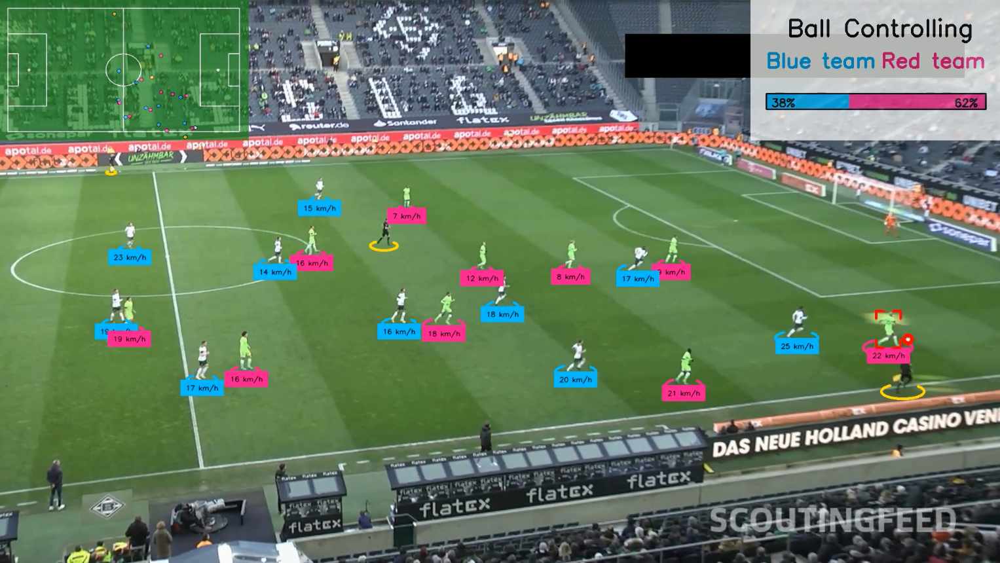

# Deep Football Analysis by Deep Learning
## Introduction
Deep Football Analysis leverages the power of cutting-edge deep learning to bring a smarter, automated way to track and analyze football matches. Using a combination of YOLOv11 - which is state-of-the-art model in object detection, Supervision, and OpenCV, this project delivers real-time insights by detecting players, tracking movements, and extracting key statistics. Whether you're a data scientist, a football analyst, or just a curious fan, this project is for you.
This project builds upon the impressive work by the Roboflow team. You can explore more of their exciting projects on their [GitHub repository](https://github.com/roboflow/sports)

## Demo output

- You can watch full demo output video at [Youtube](https://www.youtube.com/watch?v=JumrNzpESf8)


## Datasets
- Football - players detection: https://universe.roboflow.com/roboflow-jvuqofootball-players-detection-3zvbc 
- Football - ball detection: https://universe.roboflow.com/roboflow-jvuqo/football-ball-detection-rejhg
- Football - pitch keypoint detection: https://universe.roboflow.com/roboflow-jvuqo/football-field-detection-f07vi

## Modules used

- [YOLOv11](https://docs.ultralytics.com/models/yolov11/) (Players Detection) - Detects 
players, goalkeepers and referees in the video.
- [YOLOv11](https://docs.ultralytics.com/models/yolov11/) (Ball Detection) - Detects the ball in the video.
- [YOLOv11](https://docs.ultralytics.com/models/yolov11/) (Pitch Detection) - Detects keypoints on the pitch, used for perspective transformation, speed estimation and ball controlling analysis
- [KMeans](https://scikit-learn.org/stable/modules/generated/sklearn.cluster.KMeans.html) - 
Segment pixels and divide players into two teams based on their t-shirt color
- [Supervision](https://supervision.roboflow.com/0.18.0/) and [OpenCV](https://docs.opencv.org/4.x/index.html) for annotations and draw statistic information


## Requirements
To use the code in this project, the first thing you have to do after cloning this repository is to install the requirements which I have put all in the requirements.txt file
```
pip install -r requirements.txt
```

## ⚠️ Note on Real-Time Tracking

This project is fully capable of handling real-time tracking. However, pay special attention to the following part of the code:

```
crops = extract_crop(PLAYERS_MODEL, "football.mp4", 2)
team_classifier = TeamClassifier()
team_classifier.fit(crops)
```


In this example, the same video is used to fit the `TeamClassifier` model and for tracking. While this works for demonstration purposes, it is not recommended for real-time applications.

For accurate real-time performance, make sure to use a different input video in the `extract_crop` function — ideally, a recording from a previous match played on the same pitch and captured with a similar camera angle and format. This helps the model generalize better and improves team classification accuracy during live tracking.

## ⚠️ Challenges

- **Model Generalization**  
  The models used in this project have been trained on a specific dataset tailored to the project's demo setup. If you apply them to different camera angles, lighting conditions, or pitch configurations, the performance may degrade significantly.

- **Goalkeeper Misclassification**  
  While YOLOv11 generally performs well in distinguishing players and goalkeepers, it occasionally misclassifies goalkeepers — particularly when they are controlling the ball with their feet rather than their hands — as outfield players.

- **Lighting and Shadow Variability**  
  Varying lighting conditions (e.g., stadium shadows, artificial lights, night matches) can affect detection and tracking accuracy, especially in outdoor environments. Moreover, `TeamClassifier` - which implemented by `KMeans` will be affected as well when meet lighting and shadow variability

- **Occlusions and Player Overlaps**  
  Players often overlap or occlude each other, which can make detection and tracking unreliable during crowded scenes like corners or goalmouth scrambles.

- **Real-Time Processing Limitations**  
  Running deep learning models in real-time requires sufficient computational resources (especially GPU). On lower-end machines, the frame rate can drop, reducing usability for live analysis.

## 🙏 Thanks for Watching

If you find this project interesting or useful, feel free to ⭐ star the repository and share your feedback.  
Contributions and suggestions are always welcome!

Let's make football smarter together. ⚽🤖
