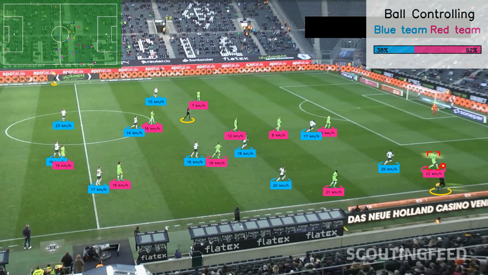

<div align="center">
  <h1>⚽ Football Tracking & Analytics</h1>
  <p>
    <strong>Advanced Deep Learning system for real-time football match analysis, player tracking, and tactical insights.</strong>
  </p>
  <p>
    
    
    
    
  </p>
</div>

---

## 📖 Table of Contents
- [Introduction](#-introduction)
- [Key Features](#-key-features)
- [Demo](#-demo)
- [Project Structure](#-project-structure)
- [Datasets](#-datasets)
- [Modules Used](#-modules-used)
- [Installation & Setup](#%EF%B8%8F-installation--setup)
- [How to Run](#-how-to-run)
- [Live Webcam & Real-Time Adaptability](#-live-webcam--real-time-adaptability)
- [Challenges & Limitations](#-challenges--limitations)

---

## 🚀 Introduction
Football Tracking leverages the power of cutting-edge deep learning to bring a smarter, automated way to track and analyze football matches. Using a combination of **YOLOv11**, **Supervision**, and **OpenCV**, this project delivers real-time insights by detecting players, tracking movements, and extracting key statistics. 

Whether you are a data scientist, a football analyst, or a curious fan, this project provides a robust foundation for sports analytics.

---

## ✨ Key Features
- **Player Tracking & Speed Estimation**: Tracks individual player movements across frames and calculates real-time speed in km/h.
- **Ball Possession Analysis**: Detects the ball, identifies the closest player, and calculates team possession percentages.
- **Bird's-Eye View (Tactical Radar)**: Projects the 3D camera perspective onto a 2D tactical minimap using keypoint transformation.
- **Automated Team Classification**: Extracts player crops and uses K-Means clustering to separate players into teams based on jersey colors.

---

## 🎥 Demo


*Watch the high-quality demo output video on [YouTube](https://www.youtube.com/watch?v=JumrNzpESf8) or find the local `.mp4` format version at `assets/demo_out.mp4`.*

---

## 📁 Project Structure
```
football-tracking/
├── assets/                       # Input videos and demo outputs
├── bird_eye_view/                # Logic for 2D tactical map and perspective transform
├── config/                       # Global settings (paths, colors, constants)
├── core/                         # Main business logic (speed, possession)
├── models/                       # YOLO weights (auto-downloaded here)
├── utils/                        # Helper functions (crop, team classifier, downloader)
├── visualizers/                  # UI and drawing configurations
├── football-demo-scripts.ipynb   # Jupyter Notebook for cloud GPU execution (Colab/Kaggle)
├── main.py                       # Main execution script
└── requirements.txt
```
---
## 📊 Datasets
The deep learning models in this project were trained on the following datasets:
- **Football - Players Detection:** [Roboflow Universe Link](https://universe.roboflow.com/roboflow-jvuqofootball-players-detection-3zvbc)
- **Football - Ball Detection:** [Roboflow Universe Link](https://universe.roboflow.com/roboflow-jvuqo/football-ball-detection-rejhg)
- **Football - Pitch Keypoint Detection:** [Roboflow Universe Link](https://universe.roboflow.com/roboflow-jvuqo/football-field-detection-f07vi)

---

## 🧩 Modules Used
- **[YOLOv11](https://docs.ultralytics.com/models/yolov11/) (Players Detection)** - Detects players, goalkeepers, and referees in the video.
- **[YOLOv11](https://docs.ultralytics.com/models/yolov11/) (Ball Detection)** - Detects the ball in the video.
- **[YOLOv11](https://docs.ultralytics.com/models/yolov11/) (Pitch Detection)** - Detects keypoints on the pitch, used for perspective transformation, speed estimation, and ball controlling analysis.
- **[KMeans](https://scikit-learn.org/stable/modules/generated/sklearn.cluster.KMeans.html)** - Segments pixels and divides players into two teams based on their t-shirt color.
- **[Supervision](https://supervision.roboflow.com/0.18.0/)** and **[OpenCV](https://docs.opencv.org/4.x/index.html)** - Used for bounding box annotations, tracking, and drawing statistical information.

---

## 🛠️ Installation & Setup

1. **Clone the repository:**
```bash
git clone https://github.com/DatND3009/Football-Tracking.git
cd football-tracking
```

2. **Create and activate a virtual environment (Recommended):**
```bash
python -m venv .venv
# On Windows:
.venv\Scripts\activate
# On Linux/Mac:
source .venv/bin/activate
```

3. **Install basic dependencies:**
```bash
pip install -r requirements.txt
```
**Note:**
If you have an NVIDIA GPU, you should ensure PyTorch is using CUDA for maximum processing speed. Run these two commands:

```Bash
pip uninstall torch torchvision -y
pip3 install torch torchvision --index-url https://download.pytorch.org/whl/cu126
```

---

## 💻 How to Run
Simply execute the main script:

```bash
python main.py
```


The script will process the default video `assets/football.mp4`. Once completed, the final annotated video will be saved as `assets/demo_out.mp4`.

**Note:** You also don't need to hunt for `.pt` files to get started. On your very first run, the `utils/downloader.py` script will use `gdown` to automatically check for the required weights. If they are missing, it fetches the Players, Ball, and Pitch models directly from Google Drive and safely places them into the `models/` directory. Just make sure you have an active internet connection the first time you execute `main.py`!

---

## 🎥 Live Webcam & Real-Time Adaptability
The current codebase is set up to process a pre-recorded .mp4. But this project is fully capable of real-time tracking.

To use a live webcam or RTSP stream, you only need to make minor modifications to the video generation loop in main.py (e.g., using `cv2.VideoCapture(0)` instead of `sv.get_video_frames_generator`).

**⚠️ Note:** 
In the current demo code, pay attention to this section:

```
crops = extract_crop(PLAYERS_MODEL, "assets/football.mp4", 2)
team_classifier = TeamClassifier()
team_classifier.fit(crops)
```
* Currently, the script uses the same video to fit the TeamClassifier and to perform the tracking. This is for demonstration purposes only.

* For a true real-time/live application, you should provide a different, pre-recorded clip (ideally with similar pitch, lighting and camera angles) to the extract_crop function to train the K-Means classifier beforehand.

---

## 🛑 Challenges & Limitations
* **Model Generalization:** Applying these models to entirely different camera angles, lighting conditions, or low-resolution broadcasts may degrade bounding-box accuracy.

* **Goalkeeper Misclassification**: YOLO occasionally misclassifies goalkeepers as outfield players when they are playing the ball with their feet far from the goal line.

* **Lighting Variability**: Stadium shadows or artificial night lights can affect the KMeans algorithm's ability to accurately separate jersey colors.

* **Occlusions**: During corners or goalmouth scrambles, players overlap heavily, which can briefly confuse the ByteTrack ID assignments.

---

## 🙏 Acknowledgements
This project builds upon the impressive foundational concepts shared by the [**Roboflow Team**](https://github.com/roboflow/sports).

If you find this project interesting or useful, feel free to ⭐ star the repository and share your feedback. Contributions, issues, and pull requests are always welcome!